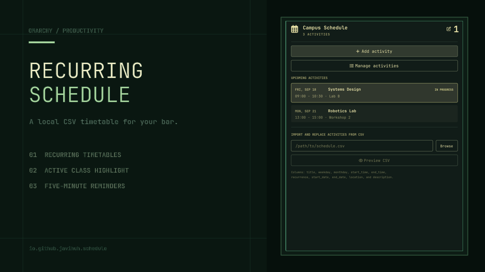

# Niku Calendar for Omarchy

An independent Omarchy bar plugin for creating and editing recurring activities,
opening class notes and links, importing CSV schedules, and receiving reminders.
It does not replace or modify the built-in clock or other calendar widgets.

> Keep your plans close and your paws ready. (=^･ω･^=)



## Features

- Native Omarchy bar widget and themed popup.
- Complete English interface by default with optional Spanish localization.
- Editable schedule title that persists independently of its activities.
- Create, inspect, edit, and delete activities directly from the bar.
- Switch between a remembered daily view and a Monday-to-Sunday weekly view.
- Distinct upcoming, `IN PROGRESS`, and `OCCURRED` activity states.
- A localized daily encouragement with a rotating cat kaomoji on busy days.
- Per-activity plain-text notes and multiple labeled HTTP(S) links, with an
  option to copy the links to every activity sharing the same title.
- Yazi file picker in an external terminal plus manual path input.
- Preview and row-level validation before an import is saved.
- One-time, weekly, biweekly, and monthly recurrence.
- Automatic accent highlight and `IN PROGRESS` label for the current activity.
- Muted styling and an `OCCURRED` label for completed occurrences.
- Native Omarchy notification ten minutes before every activity.
- Comma, semicolon, and tab delimiter detection.
- Spanish and English column aliases.
- UTF-8 and Latin-1 input support.
- Local-only processing with no network requests or third-party Python packages.

## Requirements

- Omarchy Quattro with the stock Omarchy shell.
- Python 3; the helper uses only the standard library.
- `yazi` and `xdg-terminal-exec` for the optional terminal file picker. A CSV
  path can still be entered manually when either command is unavailable.
- The built-in Omarchy notification service for ten-minute activity reminders.

The plugin requires no elevated privileges, package manager, background daemon,
or network access.

## Install

Install and enable the plugin with:

```bash
omarchy plugin add https://github.com/javihuh/recurring-schedule-omarchy.git --enable
```

The widget defaults to the right section of the bar. Move it if desired:

```bash
omarchy bar move io.github.javihuh.schedule --section center
```

Update an installed copy with:

```bash
omarchy plugin update io.github.javihuh.schedule
```

## CSV Format

Save the file as UTF-8 CSV with this header:

```csv
title,weekday,monthday,start_time,end_time,recurrence,start_date,end_date,location,description
Mathematics,monday,,08:00,09:30,weekly,2026-09-21,2026-12-18,Room 3,Weekly class
Gym,wednesday,,18:00,19:30,weekly,2026-09-23,,Sports center,
Rent payment,,5,09:00,09:15,monthly,2026-10-05,,Home,Monthly reminder
Doctor appointment,,,11:00,12:00,once,2026-10-14,2026-10-14,Clinic,Checkup
```

An editable example is included at `examples/schedule.csv`.

### Columns

| Column | Required | Meaning |
| --- | --- | --- |
| `title` | Yes | Activity name |
| `weekday` | Weekly/biweekly | `monday` through `sunday`; inferred from `start_date` when empty |
| `monthday` | Monthly | `1` through `31` or `last`; inferred from `start_date` when empty |
| `start_time` | Yes | Start time in 24-hour `HH:MM` format |
| `end_time` | Yes | End time in 24-hour `HH:MM` format |
| `recurrence` | Yes | `once`, `weekly`, `biweekly`, or `monthly` |
| `start_date` | Yes | First valid date in `YYYY-MM-DD` format |
| `end_date` | No | Inclusive final date; empty means no end |
| `location` | No | Location |
| `description` | No | Notes |

Spanish column and recurrence aliases are also accepted for compatibility.

Monthly day `29`, `30`, or `31` activities are skipped in months that do not
contain that date. Use `last` to run an activity on every month's final day.

## Usage

1. Click the calendar icon in the Omarchy bar.
2. Choose **Add activity** to create an activity manually.
3. Use **Manage activities** to inspect, edit, or delete complete recurring series.
4. Switch between **Day** and **Week**. The weekly view covers Monday through
   Sunday and groups activities by day.
5. Select an activity occurrence to open its notes, links, and editing actions.
6. Use the pencil beside the heading to rename the schedule.

The editor accepts dates as `YYYY-MM-DD` and times as 24-hour `HH:MM` values.
Weekly and biweekly activities use a weekday; monthly activities can use a day
from `1` through `31` or the final day of each month.

The editor always offers to save the link list only for the current day and
time or apply it to all activities with the same title. If no other day or time
has that title, both choices affect the same recurring series. Title matching
ignores capitalization. Applying to every match copies the links rather than
permanently synchronizing them, so one activity can later use a different URL.

The selected Day or Week view is remembered in the Omarchy bar configuration.
The large heading count always represents today's activities. An occurrence is
marked `IN PROGRESS` from its start time until, but not including, its end time;
at the end time it becomes `OCCURRED`. Past occurrences are regenerated from
the current recurring series rather than stored as immutable history.

### Language

The interface, validation messages, file picker, and reminders use English by
default. Switch the widget to Spanish with:

```bash
omarchy bar set io.github.javihuh.schedule language Español
```

Switch back with:

```bash
omarchy bar set io.github.javihuh.schedule language English
```

The setting applies live. Activity titles, notes, locations, link labels, and
other user-authored content are shown exactly as entered and are never
translated automatically.

### Importing CSV

1. Select a `.csv` file or enter its path in the import section.
2. Choose **Preview CSV**.
3. Correct any reported row errors.
4. Choose **Import and replace activities**.

The local plugin state is authoritative after an import. Editing an activity
never modifies the source CSV. Importing another CSV atomically replaces all
activities, including manually added notes and links, while preserving the
custom schedule title. The panel displays this warning before import.

The plugin checks for upcoming activities every 30 seconds while the Omarchy
shell is running. A native notification containing the activity name, time, and
location is sent during the ten-minute window before it starts. Notifications
use normal urgency and respect Do Not Disturb.

## Local Data

The normalized editable schedule is stored at:

```text
~/.local/state/omarchy/recurring-schedule/schedule.json
```

The source CSV is never modified. The stored schedule is created with user-only
permissions (`0600`) and protected by atomic writes and a revision check so
simultaneous panels cannot silently overwrite each other.

Version `0.3.0` migrates existing version 1 data automatically. Before the first
migration it preserves the original payload as `schedule.json.v1.bak` in the
same state directory.

Sent reminder occurrences are tracked in
`~/.local/state/omarchy/recurring-schedule/reminders.json` so shell reloads and
multiple monitors do not create duplicate notifications.

No schedule content is transmitted by the plugin. It only reads a selected CSV
and writes normalized local state. Saved links are validated as HTTP(S) URLs
and open in the default browser only after an explicit click.

## Remove

Remove the plugin with:

```bash
omarchy plugin remove io.github.javihuh.schedule
```

Omarchy intentionally leaves imported schedule data in place. To remove that
data as well, run:

```bash
rm -r -- "$HOME/.local/state/omarchy/recurring-schedule"
```

The original CSV is never modified or removed.

## Development

Validate the manifest and run the tests:

```bash
omarchy plugin validate .
qmllint -I /usr/share/omarchy/shell *.qml
qmltestrunner -input tests
python3 -m unittest discover -s tests -v
```

The helper can also be exercised directly:

```bash
python3 schedule.py preview examples/schedule.csv
python3 schedule.py import examples/schedule.csv
python3 schedule.py status
python3 schedule.py remind
```

Backend messages default to English. Pass `--language es` before the command
to exercise Spanish output, for example:

```bash
python3 schedule.py --language es preview examples/schedule.csv
```

Mutation commands (`rename-schedule`, `create-activity`, `update-activity`, and
`delete-activity`) accept one JSON object on standard input. They use the saved
revision to reject stale edits and are primarily consumed by the QML panel.

Planned import adapters include spreadsheets, iCalendar, PDF, images, and OCR.
CSV is intentionally the first format because it is deterministic and can be
fully validated before changing saved data.

## License

MIT, copyright 2026 javihuh.

## Support

If Niku Calendar is useful to you, you can support its development on
[Ko-fi](https://ko-fi.com/javihuh) and check it out my art ฅ^•ﻌ•^ฅ
